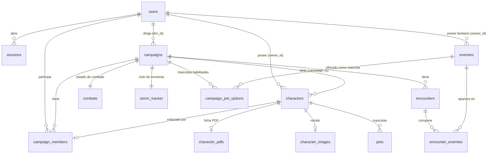

# Arquitectura y base de datos

Documento de referencia del **Cosmere / D&D Combat Tracker**: cómo está armado el
proyecto y cómo es su base de datos.

> Para instalar y usar la app, ver el [README](../README.md). Este doc es para
> entender el código.

---

## 1. Visión general

App web para llevar el combate de una mesa de rol (Cosmere RPG y D&D 5e) en tiempo real,
pensada para correr en una LAN casera.

- **Backend**: Python + [FastAPI](https://fastapi.tiangolo.com/), servido con `uvicorn`.
- **Base de datos**: SQLite con la librería estándar `sqlite3` (sin ORM). Un solo
  archivo, `cosmere.db`.
- **Tiempo real**: WebSockets con una sala por campaña (para el combate en vivo).
- **Frontend**: HTML + CSS + JavaScript vanilla (sin framework ni build). Cuatro páginas
  servidas como archivos estáticos; la UI se arma con concatenación de strings y habla
  con la API por `fetch` + el WebSocket.
- **Auth**: sesión por cookie (`sid`), contraseñas con PBKDF2. Seguridad de mesa casera,
  no de alta exigencia (pensada para LAN sin HTTPS).

Dos sistemas de juego conviven: cada **campaña** tiene un `system` (`cosmere` | `dnd`)
que decide qué parser de PDF/statblock se usa y qué mecánicas se muestran.

---

## 2. Arquitectura del backend

Punto de entrada: [`main.py`](../main.py). Crea la app FastAPI, llama a `init_db()` (crea
el esquema y corre migraciones) y monta los routers y los estáticos.

### Capas

```
HTTP / WebSocket
      │
      ▼
routers/*.py        ← endpoints por dominio (validan, orquestan)
      │
      ├── access.py      ← ¿es DM? ¿es miembro? (autorización por campaña)
      ├── auth.py        ← sesiones por cookie, hashing, usuario actual
      ├── models.py      ← modelos Pydantic (forma de los request bodies)
      ├── *_import.py / *_pdf.py  ← parsers de fichas y statblocks
      ├── state.py       ← estado del combate (cache en memoria + persistencia)
      └── database.py    ← conexión SQLite (db()) + esquema (init_db())
                              │
                              ▼
                         cosmere.db
```

- **`app/database.py`**: `db()` es un `contextmanager` que abre una conexión, aplica los
  PRAGMAs (`foreign_keys`, `busy_timeout`, `synchronous`), hace `commit` al salir y
  cierra. `init_db()` crea las tablas (`CREATE TABLE IF NOT EXISTS`) y corre las
  migraciones idempotentes. La base usa **WAL** para tolerar lecturas concurrentes
  mientras se escribe.
- **`app/auth.py`**: hashing PBKDF2, alta/baja de sesiones, y las dependencias FastAPI
  `current_user` / `optional_user`. La sesión guarda el **rol** (`dm` | `player`) elegido
  al entrar; queda fijo hasta cerrar sesión.
- **`app/access.py`**: `require_dm(conn, cid, user)` y `require_access(conn, cid, user)`
  (DM o miembro aceptado). Todos los routers de campaña los reusan para autorizar.
- **`app/models.py`**: modelos Pydantic de los cuerpos de request (validación de entrada).
- **Parsers**:
  - `app/pdf_import.py` — lee la ficha PDF de Cosmere (AcroForm `char_*`) y extrae el
    retrato.
  - `app/dnd_pdf.py` — lee la ficha PDF de D&D 5e.
  - `app/cosmere_import.py` / `app/dnd_import.py` — parsean statblocks (YAML) del
    bestiario y los exportan de vuelta a YAML.
- **`app/state.py`**: `combats` es un `CampaignCombats` con una **cache en memoria** del
  combate por campaña, respaldada en la tabla `combats`. `player_view()` recorta lo que
  ve un jugador (sin enemigos ocultos, sin nada si el combate está en preparación).
- **`app/ws.py`**: `Hub` mantiene las salas (`cid -> [(ws, is_dm)]`). `push_state(cid)`
  guarda el combate y lo difunde: al DM le manda el estado completo y a cada jugador su
  `player_view`.

### Routers (`app/routers/`)

| Router | Prefijo | Qué maneja |
|---|---|---|
| `auth` | `/api/auth` | registro, login, logout, reset, cuenta |
| `campaigns` | `/api/campaigns` | campañas, miembros, invitaciones, config, tormenta, marcos del DM, opciones de mascota |
| `characters` | `/api/characters` | personajes, PDF, imagen, mascotas, stats en vivo, heridas, marcos, recursos D&D |
| `enemies` | `/api/campaigns/{cid}/enemies` | bestiario (por DM + sistema): import, bulk, export |
| `encounters` | `/api/campaigns/{cid}/encounters` | encuentros y overrides por-encuentro |
| `combat` | `/api/campaigns/{cid}/combat` | combate en vivo (stats, turnos, vida máx, ocultar) |
| `frontend` | `/` | sirve las páginas HTML y hace el gating por rol |
| `ws` | `/ws/{cid}` | WebSocket del combate en tiempo real |

### Flujo de una acción de combate

1. El DM (o un jugador sobre lo suyo) llama a un endpoint de `combat` (p. ej. bajar vida).
2. El router valida acceso (`require_access`) y que pueda tocar a ese participante
   (`_guard_participant`).
3. Muta el combate en la **cache en memoria** (`combats`).
4. Llama a `push_state(cid)`: persiste en la tabla `combats` y **difunde por WebSocket**
   la vista que corresponde a cada cliente conectado.
5. Fuera de combate, el roster se refresca por **polling** (cada 5 s) contra
   `/campaigns/{cid}/roster`.

---

## 3. Estructura de archivos

```
combat-tracker-2.0/
  main.py                  ← crea la app y monta routers + estáticos
  requirements.txt         ← dependencias de producción
  requirements-dev.txt     ← + pytest/httpx para los tests
  pytest.ini
  app/
    database.py            ← conexión SQLite + esquema + migraciones
    auth.py                ← sesiones por cookie, hashing, rol
    access.py              ← autorización por campaña (DM / miembro)
    models.py              ← modelos Pydantic
    pdf_import.py          ← ficha PDF Cosmere + retrato
    dnd_pdf.py             ← ficha PDF D&D 5e
    cosmere_import.py      ← statblocks Cosmere (import/export)
    dnd_import.py          ← statblocks D&D (import/export)
    state.py               ← estado del combate (cache + persistencia)
    ws.py                  ← WebSockets por campaña
    routers/               ← auth, campaigns, characters, enemies,
                             encounters, combat, frontend
  static/
    login.html  home.html  dm.html  player.html
    cosmere_sheet.pdf  5e_sheet.pdf   ← fichas rellenables para descargar
  tests/                   ← suite pytest (corre contra DB temporal)
  cosmere.db               ← la base (se crea sola; no va al repo)
```

---

## 4. Base de datos

SQLite, sin ORM: el esquema vive en `init_db()` de [`app/database.py`](../app/database.py).
Los datos "de forma libre" (fichas, estados, listas) se guardan como **JSON dentro de una
columna TEXT** en vez de tablas relacionales, porque son documentos que se leen y
escriben enteros.

### Diagrama de relaciones



### Convenciones

- **Claves foráneas con `ON DELETE CASCADE`**: borrar un usuario, campaña o personaje
  arrastra todo lo suyo. `PRAGMA foreign_keys=ON` se activa en cada conexión, así que las
  cascadas funcionan.
- **Migraciones idempotentes**: cada cambio de esquema se agrega con `PRAGMA table_info`
  + `ALTER TABLE ADD COLUMN` (o `CREATE TABLE IF NOT EXISTS`), de modo que `init_db()`
  actualiza bases viejas sin perder datos y se puede correr siempre.
- **Columnas JSON (TEXT)**: `statuses`, `sheet`, `dnd_resources`, `injuries` (personajes);
  `acciones`, `stats` (enemigos/mascotas); `config` (campaña); `overrides` (encounter);
  `data` (combate). Se serializan con `json.dumps`/`json.loads`.

### Tablas

#### `users` — cuentas
| Columna | Tipo | Notas |
|---|---|---|
| `id` | INTEGER PK | |
| `username` | TEXT | único |
| `email` | TEXT | para recuperar contraseña |
| `pass_hash`, `salt` | TEXT | PBKDF2 |
| `created_at` | TEXT | |

#### `sessions` — sesiones activas
| Columna | Tipo | Notas |
|---|---|---|
| `token` | TEXT PK | valor de la cookie `sid` |
| `user_id` | INTEGER FK→users | cascade |
| `role` | TEXT | `dm` \| `player`, fijado al entrar |
| `created_at` | TEXT | |

#### `campaigns` — campañas (mesa de un DM)
| Columna | Tipo | Notas |
|---|---|---|
| `id` | INTEGER PK | |
| `name` | TEXT | |
| `dm_id` | INTEGER FK→users | dueño/DM |
| `system` | TEXT | `cosmere` \| `dnd` |
| `config` | TEXT (JSON) | parámetros: rango de tormenta, curva de descarga de marcos |
| `created_at` | TEXT | |

#### `campaign_members` — quién está en qué campaña
| Columna | Tipo | Notas |
|---|---|---|
| `id` | INTEGER PK | |
| `campaign_id` | INTEGER FK→campaigns | cascade |
| `user_id` | INTEGER FK→users | cascade |
| `character_id` | INTEGER FK→characters | el PJ con que entró (SET NULL al borrarlo) |
| `status` | TEXT | `invited` \| `accepted` |
| | | `UNIQUE(campaign_id, user_id)` |

#### `characters` — personajes de jugador
Un personaje pertenece a **una** campaña (uno por campaña por jugador, regla de la app).

| Columna | Tipo | Notas |
|---|---|---|
| `id` | INTEGER PK | |
| `owner_id` | INTEGER FK→users | dueño (jugador) |
| `campaign_id` | INTEGER FK→campaigns | campaña a la que pertenece |
| `name` | TEXT | |
| `vida_max` / `focus_max` / `inv_max` | INTEGER | máximos |
| `vida` / `focus` / `inv` | INTEGER | valores actuales (persisten fuera de combate) |
| `marcos` / `marcos_light` | INTEGER | esferas totales y cuántas están cargadas (con luz) |
| `statuses` | TEXT (JSON) | lista de estados |
| `injuries` | TEXT (JSON) | heridas `[{id, name, days, permanent}]` |
| `sheet` | TEXT (JSON) | ficha completa extraída del PDF |
| `dnd_resources` | TEXT (JSON) | `{slots, counters}` (solo D&D) |
| `has_pdf` / `has_image` | INTEGER | flags 0/1 |
| `created_at` | TEXT | |

#### `character_pdfs` / `character_images` — adjuntos del personaje
`character_id` PK/FK (1:1 con el personaje, cascade). `character_pdfs.pdf` es un BLOB con
el PDF original; `character_images` guarda el retrato (`image` BLOB + `mime`).

#### `pets` — mascotas de un personaje
Copia (snapshot) de un enemigo del bestiario que el jugador eligió como mascota. Entra al
combate como aliado que controla el jugador.

| Columna | Tipo | Notas |
|---|---|---|
| `id` | INTEGER PK | |
| `owner_id` | INTEGER FK→users | |
| `character_id` | INTEGER FK→characters | cascade |
| `name`, `vida_max`/`focus_max`/`inv_max`, `vida`/`focus`/`inv` | | como un personaje |
| `statuses`, `acciones`, `stats` | TEXT (JSON) | |
| `created_at` | TEXT | |

#### `enemies` — bestiario
El bestiario es **por DM y por sistema** (no por campaña): se comparte entre todas las
campañas del mismo DM del mismo `system`.

| Columna | Tipo | Notas |
|---|---|---|
| `id` | INTEGER PK | |
| `owner_id` | INTEGER | DM dueño (se consulta por `owner_id` + `system`) |
| `system` | TEXT | `cosmere` \| `dnd` |
| `name`, `tipo`, `clase` | TEXT | `clase`: `minion` \| `rival` \| `boss` |
| `vida_max`/`focus_max`/`inv_max` | INTEGER | |
| `acciones`, `stats` | TEXT (JSON) | ficha completa |
| `notas`, `faction_color` | TEXT | |
| `campaign_id` | INTEGER | **legacy**: quedó de cuando el bestiario era por campaña; hoy no se usa en altas nuevas |

#### `encounters` — encuentros armados
`id`, `campaign_id` (FK, cascade), `name`, `descripcion`.

#### `encounter_enemies` — enemigos dentro de un encuentro
| Columna | Tipo | Notas |
|---|---|---|
| `id` | INTEGER PK | |
| `encounter_id` | INTEGER FK→encounters | cascade |
| `enemy_id` | INTEGER FK→enemies | cascade |
| `cantidad` | INTEGER | cuántas copias |
| `overrides` | TEXT (JSON) | ajustes válidos **solo en este encuentro** (nombre, clase, vida/focus/inv máx, color); el bestiario no se toca |

#### `campaign_pet_options` — mascotas habilitadas por campaña
Qué enemigos del bestiario puede elegir un jugador como mascota, **por campaña**.
`id`, `campaign_id` (FK), `enemy_id` (FK), `UNIQUE(campaign_id, enemy_id)`.

#### `combats` — estado del combate (1 por campaña)
`campaign_id` PK/FK. `data` es un TEXT con el JSON del combate entero (participantes,
ronda, fase, turnos, estados). Es el respaldo de la cache en memoria de `state.py`.

#### `storm_tracker` — ciclo de altas tormentas (1 por campaña)
| Columna | Tipo | Notas |
|---|---|---|
| `campaign_id` | INTEGER PK/FK | |
| `day` | INTEGER | día del ciclo actual |
| `target` | INTEGER | día en que cae la tormenta |
| `moment` | TEXT | momento del día (aleatorio) |

---

## 5. Decisiones de diseño a tener en cuenta

- **Bestiario por DM + sistema, no por campaña**: un DM carga sus enemigos una vez y los
  reusa en todas sus campañas del mismo sistema. Por eso `enemies.campaign_id` quedó como
  columna muerta.
- **Snapshot de mascotas y de overrides**: elegir una mascota copia la ficha del enemigo;
  editar el enemigo después no cambia la mascota ya agregada. Los `overrides` de un
  encuentro tampoco tocan el bestiario. Esto evita sorpresas a mitad de campaña.
- **Combate: cache en memoria + persistencia**: el combate vive en `state.combats`
  (rápido, mutable) y se persiste en la tabla `combats` en cada `push_state`. Si se
  reinicia el server a mitad de combate, se restaura. Asume **un solo worker** de uvicorn
  (la cache es un dict en proceso).
- **Vista por rol**: el DM ve todo; el jugador ve `player_view` (sin enemigos ocultos, y
  nada mientras el combate está en preparación). Se aplica tanto en el WebSocket como en
  `GET /combat`.
- **Modo fijo por sesión**: el rol `dm`/`player` se elige al entrar y no se cambia sin
  volver a loguear; el router `frontend` redirige si intentás entrar al panel del otro
  rol.
- **JSON en TEXT**: fichas, estados y listas se guardan como documentos JSON. Cómodo para
  leer/escribir entero, pero **no se puede consultar por SQL** el contenido (se filtra en
  Python).

---

## 6. Tests

Suite con **pytest + TestClient** en `tests/`. Corre siempre contra una **base temporal**
(nunca toca `cosmere.db`): `conftest.py` repunta `app.database.DB_PATH` a un archivo
temporal por test y limpia la cache de combate en memoria. Cubre auth, campañas,
personajes (incluido import de PDF Cosmere y D&D), bestiario, encuentros, mascotas y
combate.

```bash
pip install -r requirements-dev.txt
pytest
```
